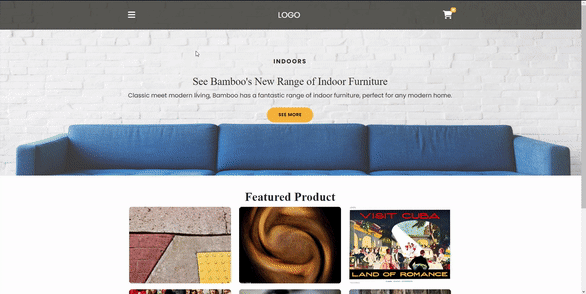

# Shopping Cart

I created shopping-cart site. In the design, I implemented the dynamics with JavaScript along with CSS and Bootstrap. 

As seen in the design, I prepared each section with the help of Bootstrap. I transferred the information from the API to each card. 
Afterwards, I prepared the dynamics with JavaScript.

I increased and decreased the quantities of the products in the basket separately. 
I created a button to delete unwanted products separately. Additionally, I added a different button to delete all products and finished the project.

<h2>Used Tech.</h2> 
<ul>
  <li>HTML was used.</li>
  <li>CSS was used in design.</li>
  <li>Bootstrap was used in design.</li>
  <li>Javascript was used in dynamics.</li>
</ul>
<h2>Screen</h2>

